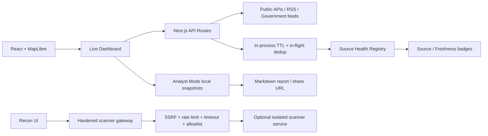

# Oculix Architecture

## المبدأ

Oculix هو **لوحة situational awareness** متعددة المصادر، وليست مصدراً وحيداً للحقيقة ولا proxy عاماً لفحص أهداف الآخرين. كل مصدر خارجي يُعامل كبيانات قد تتأخر أو تفشل، وكل استنتاج تحليلي يُعرض كإشارة استكشافية تحتاج مراجعة.

## مسار الطلب الحالي

## Data reliability contract

المصادر التي تستخدم `cachedSource` تسجل latency وrequests وcache hits وerrors ووقت آخر نجاح. الاستجابة التي تعرض بيانات مصدر حي يجب أن تحمل `metadata` يتضمن `source` و`fetchedAt` و`ageSeconds` و`freshness` و`confidence` و`status`. حالات freshness هي `LIVE` و`DELAYED` و`STALE` و`UNKNOWN`؛ ولا يُسمح لواجهة العرض بتسمية بيانات الكاش القديمة `LIVE` لمجرد أن طلب المتصفح حدث الآن.

درجة `confidence` الحالية **مؤشر جودة مصدر وحداثة** وليست إثباتاً لصحة الواقعة. لا تُملأ عند غياب الدليل أو timestamp موثوق. المحتوى الخارجي، أسماء الكيانات، IP وURL وCVE وflight numbers والتوقيت الخام لا تُترجم أو تُعاد صياغتها تلقائياً.

## Analyst Mode

Analyst Mode منفصل عن Live Dashboard. يمكن إيقاف الزمن عملياً عبر تثبيت snapshot، تحديد نطاق زمني، حفظ أحداث timeline الفعلية المتاحة، كتابة الملاحظات، حفظ سياق الخريطة، توليد تقرير Markdown، واستعادة التحقيقات من `localStorage`. المشاركة الحالية تتم عبر رابط يحمل payload للتحقيق؛ لا توجد صلاحيات تعاون أو مخزن مركزي، ولذلك لا ينبغي استخدام الرابط لبيانات حساسة.

Correlation Engine يستخدم تقارباً زمنياً ومكانياً بين أنواع مختلفة من الأحداث ويعرض **«ارتباطاً محتملاً»** فقط. لا يقدّم علاقة سببية ولا يستبدل مراجعة المصادر الأصلية.

## Recon Security Boundary

بوابة `/api/scanner` تقبل مجموعة scan types محدودة، وتفرض target length وresponse-size وtimeout وrate limit وconcurrency cap، وترفض private/loopback/link-local/metadata targets عبر SSRF guard، ولا تتبع التحويلات الخارجية تلقائياً. المفتاح وعنوان خدمة scanner يبقيان في الخادم. العزل الكامل للـworker يتطلب خدمة نشر مستقلة؛ التطبيق الحالي لا يدّعي أن العزل موجود داخل Next.js نفسه.

## الأداء والتشغيل الخلفي

التطبيق الحالي يحقق in-process caching وin-flight dedup وstale-on-error في المصادر التي تم ربطها بالمحرك المركزي، ويستخدم progressive loading وviewport-aware endpoints حيثما كان ذلك متاحاً. Redis دائم، collectors مستمرة، queues وwebhooks وpush notifications **خيارات نشر لاحقة** وليست مفعّلة في هذه الحزمة. عند الحاجة إلى polling دائم، ينبغي تشغيل collector منفصل مع Redis مشترك وتوقيع/تحقق للرسائل، لا تحويل المتصفح إلى scheduler لكل مستخدم.

## حدود الثقة

قد تتوقف RSS أو APIs أو كاميرات خارجية، وقد تُحجب بعض الـembeds. عند الفشل، تعرض الواجهة الحالة والوقت والمصدر، وتستمر الأدوات المحلية بدلاً من إخفاء المشكلة. يجب على المستخدم فتح المصدر الأصلي عند اتخاذ قرار تحليلي مهم.
